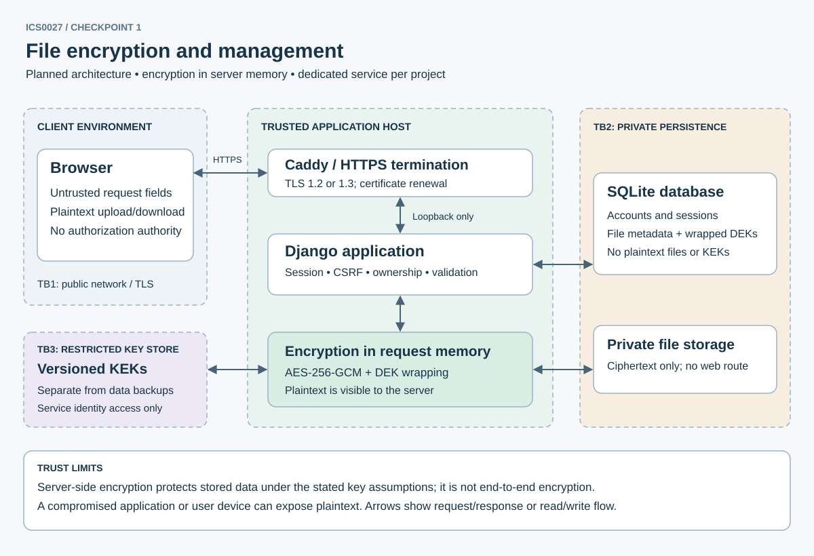

# Secure Web-Based File Encryption and Management System

Checkpoint 1: threat model and architecture.

## Scope

The planned app will let users upload, list, rename, download and delete their own files. Limits are 10 MiB per file and 100 MiB per user. Sharing, previews, archive extraction and URL imports are out of scope.

Protect file contents, account hashes, sessions, ownership records and encryption keys. Check ownership on every request and verify encrypted data before returning plaintext. Enforce quotas on the server, even with JavaScript disabled.

The server sees plaintext and holds the keys. Encryption protects stolen data only if the separate key store is safe. It cannot protect against a compromised server or user device. Quotas limit resource use but cannot prevent every denial-of-service attack.

## Architecture

TB1 separates the browser from the server. HTTPS protects traffic; submitted fields still need validation. Caddy forwards requests to a loopback-only WSGI server and overwrites the protocol header.

TB2 separates the application from private storage and SQLite. Neither is served over HTTP. A dedicated OS account accesses them after checking the file owner.

TB3 restricts access to wrapping keys. Keep them separate from data backups and readable only by the service account. On one host, this is an OS permission boundary, not hardware isolation.

Uploads pass login, CSRF, name and quota checks. The server reads at most 10 MiB into memory, encrypts it and writes a temporary ciphertext object. It then commits metadata and publishes the object; failed uploads are cleaned up. Reserve quota in a database transaction to prevent concurrent uploads exceeding it. A custom upload handler must stop oversized uploads without writing plaintext to disk. The proxy allows at most 11 MiB for the whole multipart request.

Downloads look up `(file_id, owner_id)` from the session, unwrap the file key and verify the whole ciphertext before sending any bytes. Return it as an attachment with `application/octet-stream`, `nosniff` and `no-store`.

## Stack and encryption

| Component | Choice and reason |
| --- | --- |
| Application | Python 3.12 + Django 5.2 LTS; server-rendered, autoescaped HTML and built-in sessions/CSRF reduce custom security code. Exact resolved versions are pinned in the root requirements file. |
| Database | SQLite for the single-host coursework scope; transactions and foreign keys fit account and metadata records. Move to PostgreSQL if multi-host operation or write concurrency becomes necessary. |
| Cryptography | `cryptography` AESGCM API: authenticated encryption; `argon2-cffi` via Django for account password hashing. Avoid custom primitives. |
| Storage | Private filesystem directory outside the web root, mode 0700 with 0600 objects; random UUID storage identifiers, never uploaded paths. |
| Transport | Caddy with ACME certificates; TLS 1.2/1.3 only; redirect HTTP to HTTPS. Separate production hostname from the password manager. |

For every new file version generate a random 32-byte data-encryption key (DEK) and a random 12-byte nonce using the OS CSPRNG. Encrypt bytes with AES-256-GCM. Encode additional authenticated data (AAD) in a consistent, versioned format containing application ID, owner UUID, file UUID and content version. Store nonce and ciphertext including the 16-byte tag. Never reuse a `(key, nonce)` pair; updates create a new DEK.

Wrap each DEK with AES-256-GCM under a versioned server key-encryption key (KEK), a fresh 12-byte nonce and domain-separated AAD containing the owner/file/version/key IDs. Track wrapping nonces under a unique `(kek_id, nonce)` constraint; regenerate on collision. Store the wrapped DEK, wrapping nonce, KEK ID, data nonce and algorithm/version metadata in the database. A KEK lives in an OS-protected secret file or managed secret service, never in source control or the same backup as ciphertext. Rotate KEKs by rewrapping DEKs; retain old KEKs until verified backup retention expires. Key loss means file loss; test encrypted backup restoration with separate recovery of KEKs.

Planned tables: Django account and session tables; `File(id, owner_id, display_name, size, object_id, content_version, data_nonce, wrapped_dek, wrap_nonce, kek_id, created_at)`; `AuditEvent(actor_id, action, opaque_object_id, result, timestamp)`. Filenames, sizes, ownership and timing remain visible in the database; this is an accepted metadata leak. Never log file bytes, passwords, keys or session IDs. Display names are bounded to 255 characters, reject path separators/control characters, and are output-escaped even after validation.

## Login, sessions and HTTPS

Account passphrases must be 15-128 characters and pass common-password checks. Django stores salted Argon2id hashes. A shared, atomic database limiter allows 5 failed attempts per account and 20 per source IP in 15 minutes before temporary backoff. Use generic errors and ignore client-supplied IP headers. Django does not supply this limiter.

Django `login()` rotates or replaces the session and rotates the CSRF secret. Store sessions in the database. The production cookie is `__Host-files_session; Secure; HttpOnly; SameSite=Strict; Path=/`, with no Domain. Use a separate CSRF cookie with the same flags and a masked token in each form. Check CSRF and origin on POST, including downloads. Never put session tokens in URLs or localStorage.

Check login time and last activity on every authenticated request. Expire sessions after 15 idle minutes or 8 hours total; activity cannot extend the absolute deadline. Logout and password changes revoke sessions. Clear expired records daily. There is no 'remember me' option. Cookie settings exist now; these login and timeout checks are planned.

Production needs a separate hostname, random signing secret and valid TLS certificate. Caddy redirects HTTP to HTTPS and permits TLS 1.2/1.3. Enable `TRUST_TLS_PROXY=1` only when the proxy overwrites the header and direct backend access is blocked. Test HTTPS and renewal before enabling one-year HSTS. Subdomain coverage and preload require a domain review. Remote storage or database connections would also need TLS. No service is deployed yet.

## Threat model

Risks are likelihood/impact before controls. The controls are planned. IDs match the [test plan](../../docs/ACCEPTANCE.md). Categories follow OWASP Top 10:2025 [L1, O1].

| ID / OWASP | Concrete attack and risk | Intended mitigation / residual limit |
| --- | --- | --- |
| F01 / A01 Broken Access Control | Change UUID or hidden owner field to download/delete another user's file (high/high; Weeks 2-3). | Query by session owner and UUID for every operation; reject owner fields; return the same 404 for missing and unowned records. UUID secrecy is not authorization. |
| F02 / A02 Security Misconfiguration | Debug traceback, public storage path or forged proxy header exposes data (medium/high). | DEBUG off, allowed hosts, loopback backend, no media route, least privilege, verified TLS and secure headers. Host compromise remains fatal. |
| F03 / A03 Software Supply Chain Failures | Malicious dependency or build action executes server code (medium/high). | Pin dependency versions and action commit IDs, review lock updates, dependency alerts and least-privilege CI. Pinning does not prove code trustworthy. |
| F04 / A04 Cryptographic Failures | Read stolen backups; reuse nonce; expose KEK in repository (medium/high). | AES-GCM envelope encryption, separate KEK storage, fresh DEK per version, nonce uniqueness, key rotation and restore test. Metadata stays visible. |
| F05 / A05 Injection | Filename contains HTML phishing form or stored script; reflected search or future DOM code executes input (high/high; Weeks 3-4). | Autoescape HTML and quoted attributes; display names as text; no HTML preview, `safe`, `eval`, `innerHTML` or string timers; use `textContent` if JS is added. CSP forbids scripts initially and restricts forms. Label user-controlled names to distinguish them from system notices. |
| F06 / A06 Insecure Design | Disable JS/maxlength; forge size or quota field; concurrent uploads exhaust disk/RAM (high/medium; Week 3). | Server counts bytes, enforces 10 MiB/100 MiB limits, serializes quota reservations, bounds worker concurrency and request time. No archive extraction. |
| F07 / A07 Authentication Failures | Guess password, fixate session or reuse cookie after logout (high/high; Week 2 session foundations). | Argon2id, generic failures, throttles, session rotation, idle/absolute expiry and server-side invalidation. Stolen active cookies remain valuable until revoked. |
| F08 / A08 Software or Data Integrity Failures | Swap ciphertext or wrapped DEK between records; alter stored bytes (medium/high). | Bind owner/file/version in AAD; reject invalid tag before output. Valid old backups can still roll back data: audit versions and restrict backup writes. |
| F09 / A09 Security Logging and Alerting Failures | Repeated denied access or decryption failures go unnoticed (medium/high). | Structured redacted audit events; alert on 10 denied accesses or 3 integrity failures per account in 10 minutes; retain 30 days with restricted access. |
| F10 / A10 Mishandling of Exceptional Conditions | Disk full or corrupted metadata leaves orphan plaintext, partial response or inconsistent quota (medium/high). | Ciphertext-only staging, atomic publication with recovery cleanup, generic errors, no partial plaintext release, fail closed on key/tag/DB failures. |
| F11 / A01, A07 | Cross-site POST or frame tricks a user into deleting a file (medium/high). | CSRF on all mutations, no state-changing GET, Strict cookies and frame denial. XSS can bypass CSRF by acting as the user. |

Course mapping: Week 1 risk categories; Week 2 HTTP, cookies and TLS; Week 3 tampering, validation bypass and spoofing; Week 4 XSS. Supply chain and recovery cover the remaining Top 10 categories. HttpOnly cannot stop injected scripts from making requests or reading downloads.

## Implementation status

The starter runs locally and tests headers, escaping and configuration. File operations, keys and login still need implementation. Run tests F01-F11 before storing real files. See [sources](../../docs/SOURCES.md).
