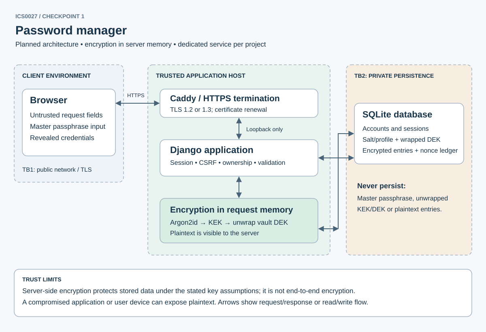

# Web-Based Secure Password Manager

Checkpoint 1: threat model and architecture.

## Scope

The planned app will let users create, reveal, edit and delete entries containing a title, URL, username, password and notes. An account password handles login. A separate master passphrase protects the vault; reject equal values at setup. Sharing, extensions, autofill, HTML notes, remote favicons and password recovery are out of scope.

Protect credentials, sessions, vault keys and ownership. Another account must not access a vault. A stolen database should require guessing the master passphrase to read entries.

Encryption happens on the server, which receives the master passphrase over HTTPS. The server is trusted with plaintext. A compromised server or XSS during reveal can steal secrets. Rate limits cannot stop offline guessing against a copied database, so the master passphrase must be strong.

## Architecture

TB1 separates the browser from the application. TLS protects traffic, but inputs still need validation. TB2 separates the application from private SQLite storage, which holds no plaintext credentials or unwrapped keys. OS administrators remain trusted. Each project has a separate hostname, service account, database, signing secret and cookie names.

Each credential operation checks login, CSRF and ownership. The user re-enters the master passphrase in a POST body. The server derives a wrapping key, unwraps the vault key and encrypts or decrypts the entry in request memory. It discards those values when done. Keys never enter sessions, caches, logs, URLs or browser storage. There is no persistent unlocked session.

Python cannot guarantee memory erasure. Keep secrets short-lived, disable body logging, crash dumps and debug tools, and protect swap.

## Stack and encryption

Use Python 3.12 and Django 5.2 LTS for sessions, CSRF and escaped HTML templates. SQLite is enough for a single-host project and supports transactions. Use `argon2-cffi` for key derivation and `cryptography` for encryption. Versions are pinned in `requirements.txt`. Caddy handles TLS 1.2/1.3 and certificate renewal, forwarding to a loopback-only WSGI server [O2-O6].

Vault creation: accept a master passphrase of 15-128 characters, without silent trimming/truncation/normalization; encode it as UTF-8. Generate a random 16-byte salt. Derive a 32-byte key-encryption key (KEK) using Argon2id v19 with memory 65,536 KiB, 3 iterations, parallelism 1, and 32-byte output. These are initial parameters to benchmark on deployment hardware (target approximately 250-750 ms with bounded concurrency); changing the target never silently weakens existing vaults. Store the salt and versioned parameter profile with the vault. Validate stored profiles against a server allowlist before allocating KDF memory.

Generate a random 32-byte vault data-encryption key (DEK). Wrap it using AES-256-GCM with the derived KEK and a fresh random 12-byte nonce. Additional authenticated data (AAD) is consistently encoded, versioned metadata containing application ID, owner UUID, vault UUID and the KDF profile/salt. Store the wrapped DEK, nonce, tag, salt and KDF parameters. Do not store the KEK or DEK in plaintext. The authenticated wrapped key checks the master passphrase, so no additional master-password verifier is needed. Authentication uses a separate Django Argon2id account-password verifier and independent salt; it cannot be used as an encryption key.

Entries: encrypt the complete consistently encoded JSON payload (title, URL, username, password and notes) on the server with the vault DEK and a fresh 12-byte nonce on every write. AAD binds application ID, owner UUID, vault UUID, entry UUID and version. The database enforces uniqueness of `(vault_id, nonce)` across retained entry encryption records; retain a record of used nonces for deleted/replaced entries until that DEK is retired. On collision generate a new nonce before writing. Reject any tag failure with a generic error and no partial plaintext. No plaintext search index is stored; listing initially exposes only opaque IDs and timestamps, while viewing titles requires a master-password-protected decrypt operation.

Master-password change: verify the old master passphrase, unwrap the DEK, derive a new KEK with a new salt, then rewrap the same DEK with a fresh nonce and current profile. Commit the entire wrapper/profile update in one transaction; encrypted entries remain unchanged. Old backups remain decryptable with the old master passphrase. If the DEK may be compromised, rotate it and re-encrypt every entry; merely changing the master passphrase is insufficient. Forgotten master passphrases cannot recover the vault. A future account-password reset must not bypass encryption or replace an existing vault silently.

Planned schema:

| Table | Stored fields |
| --- | --- |
| Account / session | Account identity, independently salted account-password verifier; opaque server-side session metadata, never vault keys |
| Vault | UUID, unique owner ID, KDF salt/profile, wrapped DEK plus tag, wrap nonce, format version |
| Entry | UUID, vault ID, ciphertext plus tag, nonce, version, created/updated timestamps |
| Nonce ledger | Vault ID and every nonce used under the active DEK; unique constraint |
| Audit event | Actor ID, action, opaque object ID, outcome, timestamp; no entry contents or request bodies |

The database reveals account identity, vault existence, entry count, ciphertext sizes and access timing. Encrypted backups remain susceptible to offline guessing and rollback; backups are access-restricted and restoration tests check versions. There is no server recovery key.

## Login, sessions and browser controls

Account passphrases must be 15-128 characters and pass common-password checks. Store salted Argon2id hashes. Use generic errors and an atomic limiter: 5 failed account or master-passphrase attempts per account, and 20 per source IP, within 15 minutes before backoff. Limit concurrent KDF requests to bound memory use. Ignore client-supplied IP headers.

Django `login()` rotates or replaces the session and rotates CSRF state. Store sessions in the database. The production cookie is `__Host-vault_session; Secure; HttpOnly; SameSite=Strict; Path=/`, with no Domain. Use a separate CSRF cookie with the same flags and masked tokens in forms. Credential operations, logout and master-password changes require POST with CSRF and origin checks. GET never reveals secrets or changes data.

Enforce a 5-minute idle timeout and 1-hour absolute expiry before each credential operation. Logout, expiry and account-password changes revoke sessions. Changing the master passphrase also revokes other sessions. Entering it again cannot extend the absolute deadline.

Optional WebAuthn MFA could protect login and account changes later. It does not replace the master passphrase or stop offline guessing.

Use `no-store`, frame denial, `nosniff`, no-referrer and CSP. Scripts are currently forbidden. Future JavaScript must be local and use `textContent` or input `.value`, never `innerHTML` or `eval`. Decrypted text still needs escaping. Display URLs as text, or allow only parsed HTTP/HTTPS links; never fetch them on the server. Keep entry labels separate from system messages. A future reveal control will clear fields after 30 seconds, but cannot erase copied data or browser memory. HttpOnly cannot stop XSS from sending reveal requests.

Production needs its own hostname, random signing secret, secure cookies and Caddy TLS. Check HTTPS and renewal before enabling one-year HSTS. Only trust the protocol header when the proxy overwrites it and direct backend access is blocked. Local HTTP is for the empty starter only. Nothing is deployed yet.

## Threat model

Risks are likelihood/impact before controls. The controls are planned. Categories follow OWASP Top 10:2025 [L1, O1].

| ID / OWASP | Concrete attack and risk | Intended mitigation / residual limit |
| --- | --- | --- |
| P01 / A01 Broken Access Control | Tamper with entry UUID or hidden vault/owner fields to reveal another vault (high/high; Week 3). | Check the logged-in owner in every query; set ownership on the server; the same 404 for missing and unowned records; master knowledge alone never authorizes another account. |
| P02 / A02 Security Misconfiguration | Debug trace, public SQLite backup or request tracing exposes master passphrase (medium/high). | Disable debug/body logging, private DB permissions, TLS, explicit hosts, separate secrets and no public backups. Server administrators remain trusted. |
| P03 / A03 Software Supply Chain Failures | Compromised KDF dependency or frontend asset steals secrets (medium/high). | Locked dependencies, pinned CI action commits, review updates, dependency alerts, no third-party runtime scripts/CDNs. |
| P04 / A04 Cryptographic Failures | Offline master guessing, nonce reuse or plaintext key stored in a session (high/high). | Memory-hard Argon2id with independent salt, AES-GCM, record of used nonces and keys kept only during the request. Weak master passphrases remain guessable offline. |
| P05 / A05 Injection | Stored notes/title inject HTML login form; reflected errors inject script; DOM reveal uses `innerHTML` (high/high; Weeks 3-4). | Encode decrypted content on output; no rich HTML, JS string interpolation or dangerous sinks; forbid scripts initially, restrict form action; label user text. Parameterized ORM queries. |
| P06 / A06 Insecure Design | Bypass JS length checks, forge KDF memory parameters or abuse reset to gain decryption (high/high; Week 3). | Server validates 15-128 passphrase length, 8 KiB encoded JSON payload and 100-entry quota; allowlisted KDF profiles; bounded concurrency; account reset cannot unwrap keys. |
| P07 / A07 Authentication Failures | Brute-force login/unlock, fixate cookie, reuse expired session (high/high). | Argon2id account hashes, login/master throttles, rotation, idle/absolute expiry, revocation and optional future WebAuthn. |
| P08 / A08 Software or Data Integrity Failures | Move valid entry ciphertext to another owner; alter wrapper/profile (medium/high). | AAD binds owner/vault/entry/version and wrapper profile; verify tags before release. Database rollback of authentic old records still requires operational detection. |
| P09 / A09 Security Logging and Alerting Failures | Repeated reveals or master failures leave no evidence (medium/high). | Record redacted outcomes and opaque IDs; alert on 10 denied accesses or 3 integrity failures in 10 minutes; 30-day restricted retention. Never log secret text. |
| P10 / A10 Mishandling of Exceptional Conditions | Wrong master, malformed ciphertext or interrupted rewrap returns partial secret or locks out vault (medium/high). | Fail closed, generic response, authenticate before rendering, atomic rewrap and restore tests; release request references on success and exceptions. |
| P11 / A01, A07 | Cross-site request deletes credentials or reveals through a frame (medium/high). | POST plus CSRF/origin checks, Strict cookies and frame denial; require master passphrase for credential actions. Active XSS can observe it. |

Course mapping: Week 1 risk categories; Week 2 HTTP and sessions; Week 3 control bypass and spoofing; Week 4 stored, reflected and DOM XSS. Encrypting in the browser would still leave secrets exposed to malicious JavaScript.

## Implementation status

The starter runs locally. Login, encryption and credential storage still need implementation. Run tests P01-P11 in the [test plan](../../docs/ACCEPTANCE.md) before accepting secrets. See [sources](../../docs/SOURCES.md).
